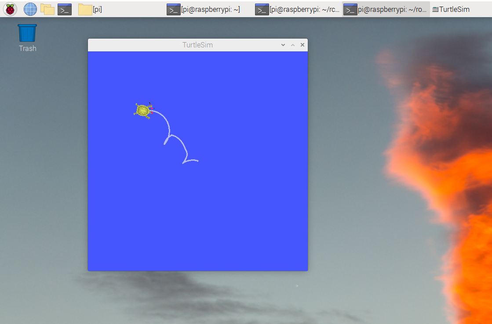

# rpi-bullseye-ROS2

Build ROS2-Galactic for Raspbian-bullseye



## Overview

Scripts for build ROS2 to running on Raspbian.

Support : ROS2 Galactic Desktop

> Rviz2 and Rqt are not supported. (view issue)


## Build

On Raspberry Pi Bullseye

```bash
git clone https://github.com/Ar-Ray-code/rpi-bullseye-ros2.git -b galactic
cd rpi-bullseye-ros2
bash build.bash $HOME
> password
```

Load ROS2

```bash
source $HOME/galactic/setup.bash
```

## Install

On Raspberry Pi Bullseye

```bash
curl -s https://raw.githubusercontent.com/Ar-Ray-code/rpi-bullseye-ros2/main/install.bash | bash
```

Load ROS2

```bash
source $HOME/galactic/setup.bash
```

## About author

- author : [Ar-Ray](https://github.com/Ar-Ray-code)
- [Twitter](https://twitter.com/Ray255Ar)
