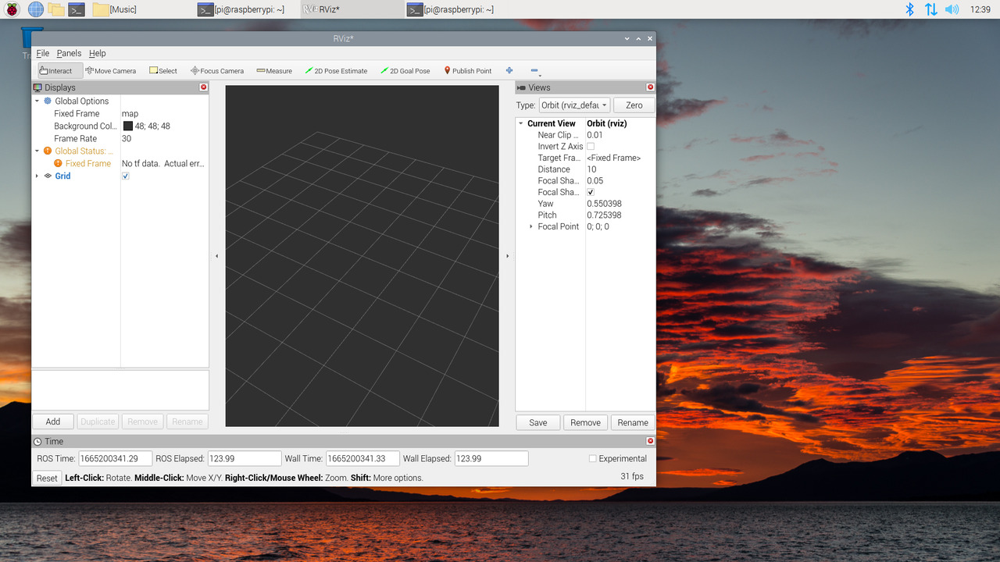

# Raspberry Pi OS ROS2

Build ROS2 for Raspbian



<br>

## Support

### Latest : ros2-0.3.2

[ros2-0.3.2](https://github.com/Ar-Ray-code/rpi-bullseye-ros2/releases/tag/ros2-0.3.2)

| Distro | Debian | arm64-desktop | arm64-full |
| --- | --- | --- | --- |
| iron | bullseye | [URL](https://s3.ap-northeast-1.wasabisys.com/download-raw/dpkg/ros2-desktop/debian/bullseye/ros-iron-desktop-0.3.2_20230611_arm64.deb)
| iron | bookworm | [URL](https://s3.ap-northeast-1.wasabisys.com/download-raw/dpkg/ros2-desktop/debian/bookworm/ros-iron-desktop-0.3.2_20231028_arm64.deb)
| humble | bullseye | [URL](https://s3.ap-northeast-1.wasabisys.com/download-raw/dpkg/ros2-desktop/debian/bullseye/ros-iron-desktop-0.3.2_20230611_arm64.deb)

### Install (bullseye)

- OS   : RaspberryPi OS bullseye arm64
- ROS2 : ROS2 Humble

```bash
wget https://github.com/Ar-Ray-code/rpi-bullseye-ros2/releases/download/ros2-0.3.1/ros-humble-desktop-0.3.1_20221218_arm64.deb
sudo apt install ./ros-humble-desktop-0.3.1_20221218_arm64.deb
sudo pip install vcstool colcon-common-extensions
```

### Install (bookworm)

- OS   : RaspberryPi OS bookworm arm64
- ROS2 : ROS2 Iron

> When using Rviz2, switch the display server from Wayland to X11.


```bash
wget https://s3.ap-northeast-1.wasabisys.com/download-raw/dpkg/ros2-desktop/debian/bookworm/ros-iron-desktop-0.3.2_20231028_arm64.deb
sudo apt install ./ros-iron-desktop-0.3.2_20231028_arm64.deb
sudo pip install --break-system-packages vcstool colcon-common-extensions
```

## Uninstall

```bash
sudo apt remove ros-${DISTRO}-desktop
# e.g. sudo apt remove ros-humble-desktop
```

<br>

### Load ROS2

```bash
source /opt/ros/${DISTRO}/setup.bash
# e.g. source /opt/ros/humble/setup.bash
```

<br>

<details><summary>ros2-0.2.0</summary>

[ros2-0.2.0](https://github.com/Ar-Ray-code/rpi-bullseye-ros2/releases/tag/ros2-0.2.0)

| Distro | aarch64 |
| --- | --- |
| humble | ✔ |
| galactic | |

### Install

- OS   : RaspberryPi OS bullseye aarch64
- ROS2 : ROS2 Humble

```bash
# (humble, aarch64)
curl -O https://raw.githubusercontent.com/Ar-Ray-code/rpi-bullseye-ros2/main/install.bash
# bash install.bash <distro> <arch> <version> <install-dir>
bash install.bash humble aarch64 0.2.0 /opt/ros
```

<br>

</details>

<details><summary>ros2-0.1.0</summary>

<br>

[ros2-0.1.0](https://github.com/Ar-Ray-code/rpi-bullseye-ros2/releases/tag/ros2-0.1.0)


### ❌ Excluded packages ❌

- RViz
- rosbag
- rqt

<br>

| Distro | aarch64 | arm7l |
| --- | --- | --- |
| humble | ✔ | ✔ |
| galactic | | ✔ |

### Install

- OS   : RaspberryPi OS bullseye aarch64
- ROS2 : ROS2 Humble

```bash
# (humble, aarch64)
wget https://raw.githubusercontent.com/Ar-Ray-code/rpi-bullseye-ros2/main/install.bash
bash install.bash humble aarch64 0.1.0 /opt/ros

# galactic, arm7l
# bash install.bash galactic arm7l 0.1.0 /opt/ros
```

### Load ROS2

```bash
source /opt/ros/humble/setup.bash
```

<br>

</details>

<br>


## Build ROS2

- [README](./build/README.md)

<br>

## Cross compile 🛠️

- [Ar-Ray-code/rpi-bullseye-ros2-xcompile](https://github.com/Ar-Ray-code/rpi-bullseye-ros2-xcompile)

<br>

## About author

- author : [Ar-Ray](https://github.com/Ar-Ray-code)
- [X (Twitter)](https://twitter.com/Ray255Ar)

<br>

## Support me!

このプロジェクトは学生向けの軽量なROS2環境を提供するためにあります。
あなたがもしこのプロジェクトに助けられた場合、その助けを継続する支援をお願いします。

This project is to provide a lightweight ROS2 environment for students.
If you have been helped by this project, please help us continue that help.

[sponsors/Ar-Ray-code](https://github.com/sponsors/Ar-Ray-code?preview=true)
